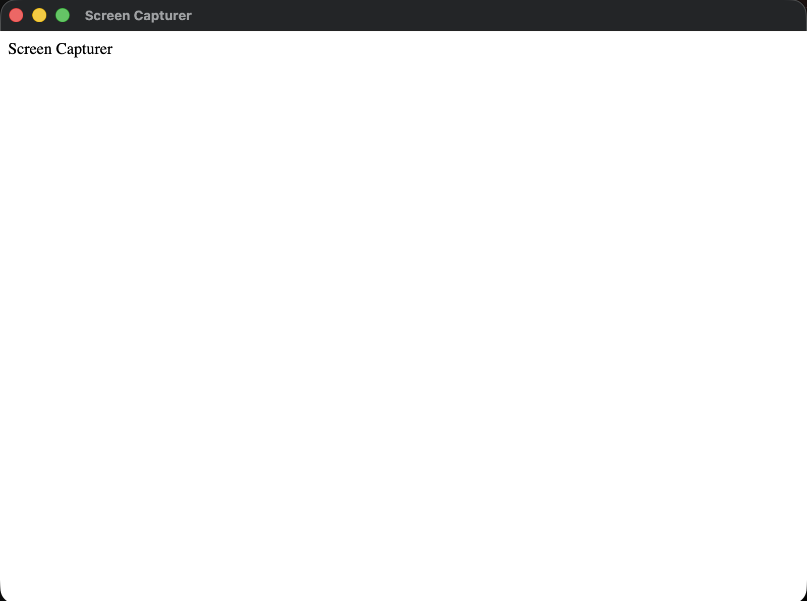

The first thing to do is to create a nodejs app where it has a `package.json` file.<br>
Obviously an electron app's first requirement is to install the `electron` package:<br>

```bash
npm install electron --save-dev
```

Now add a start command in the `scripts` property.<br><br>

## How to start the application

Start the application simply writing this much in the `main.js` file:

```js
const { app, BrowserWindow } = require("electron")

// Is the app ready and initialized ? Show the app window
app.whenReady().then(() => {
  const window = new BrowserWindow()
})
```

`new BrowserWindow()` is responsible for the app window to show up. We can see that running `npm start` command.

## How to show an interface

First of all, include an `index.html` file. In this file you write all the things you want to show. For example:

```html
<html>
  <head>
    <title>Screen Capturer</title>
  </head>
  <body>
    <span>Screen Capturer</span>
  </body>
</html>
```

How would you show this into the window? load the `html` code this way:

```js
app.whenReady().then(() => {
  const window = new BrowserWindow()
  window.loadFile("index.html") // here you load the html
})
```

<br>
Here we can add styling as well. Adding styles to the code is just like how you do it in a normal html-css project — include a style file and link it to the html file, that's it.

## How to enable auto reloading?

Every time we change something, to see the change we need to stop the server and start it again. To avoid this, we can use nodemon.<br>
add `nodemon` package as a dev dependency. Then add a script property `dev`:<br>

```json
"scripts": {
  "start": "electron .",
  "dev": "nodemon --ext js,css,html --exec electron .",
  "test": "echo \"Error: no test specified\" && exit 1"
},
```
