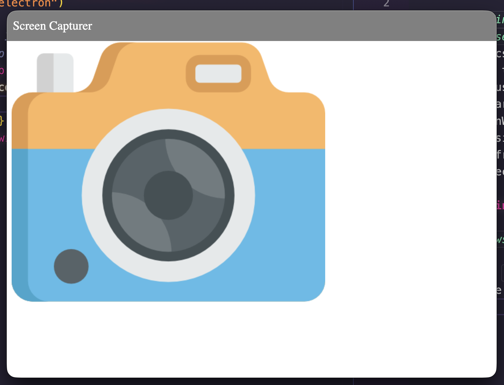
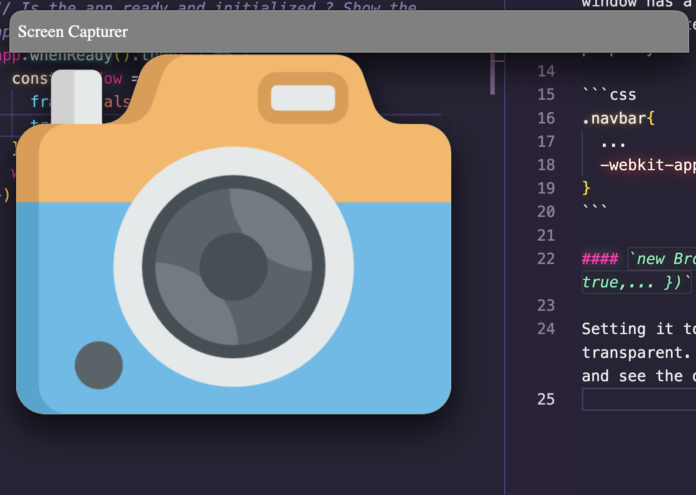
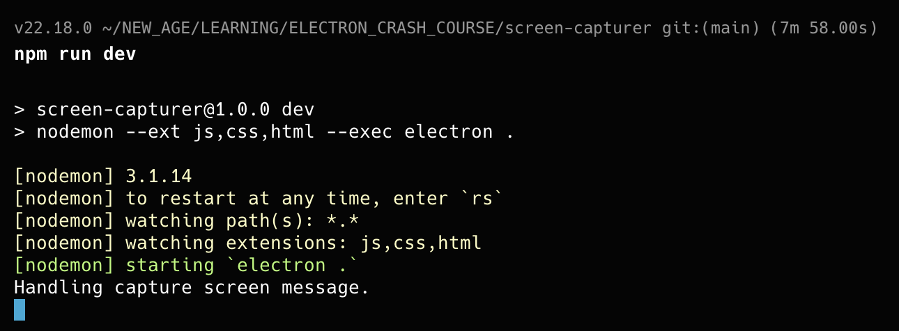

## Tweaking the window

`new BrowserWindow()` takes a single options object (`BrowserWindowConstructorOptions`). Electron's docs list 60-70+, but you'll realistically touch only a small set of them in your regular use.<br>
Some of them are: width, height, x/y (screen position), minWidth/minHeight, maxWidth/maxHeight, resizable, maximizable, minimizable, title, icon, frame, alwaysOnTop, webPreferences (a nested object)...<br>

### What are in this project's use case

#### `new BrowserWindow({ frame: false,... })`

Setting it to `false` makes the frame gone. So, you can't have the top bar, where it has options to maximize/minimize or make it disappear.<br>
<br>
So, how do we drag the window in this scenario?<br>
There is a cheeky way to do that in this situation — you can make any part of the the window able to drag the window. For example the window has a navbar (written in the html file or the frontend). Now add the `draggable` property:

```css
.navbar{
  ...
  -webkit-app-region: drag;
}
```

#### `new BrowserWindow({ transparent: true,... })`

Setting it to `true` makes the window transparent. So, you can see through the window and see the desktop or other apps behind it.<br>

<br>

## Communication between the renderer process and the main process

The renderer process is frontend. And the main process is the backend.<br><br>

To control the renderer process, we need a javascript script. So, add a js script to the frontend:

```html
<html>
  <head>
    <link rel="stylesheet" href="style.css" />
    <script src="renderer.js"></script>
    <title>Screen Capturer</title>
  </head>
</html>
```

```js
const { ipcRenderer } = require("electron")
```

here, this module will allow render process to use ipc to communicate with the main process.<br><br>
By default node is not allowed to use render process. The render process cannot use node api.<br>
Sometimes node can be allowed to use for render process, but that's not allowed in the production.

To use node in the development process, you need to enable that in via these webPreferences properties in the main process:

```js
// main.js
app.whenReady().then(() => {
  const window = new BrowserWindow({
    webPreferences: {
      contextIsolation: false,
      nodeIntegration: true,
    },
    ...
  })
  window.loadFile("index.html")
})
```

### Communicating from the render process to the main process

Using ipc, you send a message that to be received in the main process:

```js
// renderer.js
const { ipcRenderer } = require("electron")

document.getElementById("camera-btn").addEventListener("click", () => {
  ipcRenderer.send("capture-screen")
})
```

```js
// main.js
app.whenReady().then(() => {
  const window = new BrowserWindow({...})
  ...

  ipcMain.on("capture-screen", () => {
    console.log("Handling capture screen message.")
  })
})
```

clicking the camera button, we can see the message logging in the main process terminal.<br>
<br>
